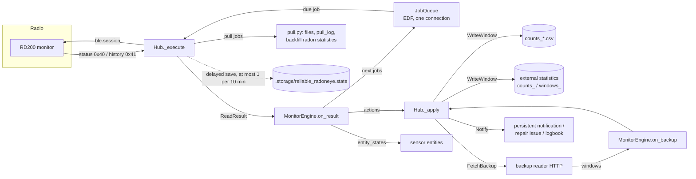

# Architecture

This document describes how Reliable RadonEye (domain `reliable_radoneye`) is built. It covers the module
layout, the data flow, the read scheduler, retries and deadlines, persistence and failure isolation. Every
number here is taken from the code at version 0.3.2. Where the original design spec says something different,
the difference is noted.

Related documents: [counts-method.md](counts-method.md) (the measurement), [protocol.md](protocol.md) (the
Bluetooth protocol), [data-formats.md](data-formats.md) (files and storage), [development.md](development.md)
(tests and releases).

---

## 1. Design principle: a pure core and a thin Home Assistant layer

Every decision lives in `custom_components/reliable_radoneye/core/`. That package imports **nothing from Home
Assistant**. It also has no clock, no Bluetooth and no file or network I/O, except `core/archive.py`, which
appends CSV rows. The modules around it (`hub.py`, `ble.py`, `pull.py`, `stats.py`, the entity platforms and
the config flow) only *execute* what the core decides.

```
            +-----------------------------------------------------------+
            |                 Home Assistant layer (thin)               |
            |  __init__.py  config_flow.py  hub.py  ble.py  pull.py     |
            |  stats.py  sensor.py  binary_sensor.py  protocol.py       |
            +-----------------------------+-----------------------------+
                                          | read results, time
                                          v
            +-----------------------------------------------------------+
            |                   core/ (pure, stdlib only)               |
            |  engine.py  schedule.py  windows.py  radon_math.py        |
            |  reliability.py  timing.py  archive.py                    |
            +-----------------------------+-----------------------------+
                                          | jobs, actions, entity values
                                          v
                         executed by hub.py (BLE, files, statistics,
                         notifications, repair issues, logbook)
```

### Why

- **Testability.** The core runs under plain `python -m unittest` with no Home Assistant install. The engine is
  a state machine: you give it a read result and the current time, and it returns follow-up jobs and actions.
  The tests can therefore simulate days of reads against fake monitors in milliseconds, with a fake clock
  (`tests/sim.py`). That includes many monitors, reboots, Home Assistant restarts, failure patterns, firmware
  changes and different counting-window lengths. Code that touches Home Assistant cannot be tested this way
  without a full HA test harness.
- **Determinism.** Because the core has no clock, every time-dependent rule (staleness, 4 h blocks, 24 h
  re-test, 8-day retention) takes `now` as an argument. A test can therefore reproduce a schedule exactly.
- **Reuse.** `core/windows.py` has no relative imports on purpose: the optional backup reader
  (`extras/backup_reader/rd200_counts.py`) copies it next to itself and imports it as a top-level module.
  The window identity, dedupe and capture rules are then the same code on both machines.
- **Review.** Every change that alters behaviour lands in `core/`, where it has to come with a test. The HA
  layer changes rarely, and when it does the change is mechanical.

### Module map

| Module | Kind | Responsibility |
|---|---|---|
| `core/engine.py` | pure | `MonitorEngine`, one per monitor. It takes read results and backup replies, and returns jobs plus actions (`WriteWindow`, `FetchBackup`, `Notify`). It computes the entity values, and it saves and restores its own state (`to_state`). |
| `core/schedule.py` | pure | Slot offsets (A +1:00, B +6:00, parallel +4:30), retry delays, session caps, the `Job` record, and `JobQueue` (earliest deadline first, integration-wide). |
| `core/windows.py` | pure, standalone | `Window` (identity, compact Store row), `captured_window` (which window a read captures), `WindowLog` (dedupe and merge), `hour_totals`, `BootTracker` (reboot detection), and `WindowValidator` (checks the window model live). |
| `core/radon_math.py` | pure | The Poisson CDF, the Garwood interval (cached), `derive` (radon from counts, with coverage), and `counts_from_hourly_mean`. |
| `core/reliability.py` | pure | `ReliabilityBlocks` (first-attempt success per fixed 4 h local block) and `RadioTime` (share of the last hour spent connected). |
| `core/timing.py` | pure (asyncio) | `capped_then_close`: caps connect + read, then always runs the disconnect under its own cap. |
| `core/archive.py` | pure (file I/O) | Appends one row per captured window to the daily count CSV. |
| `hub.py` | HA | `Hub`: one background task serves the queue. It runs BLE sessions and applies actions: CSV, external statistics, notifications, repair issues, logbook entries, backup-reader HTTP. It owns the `Store`. |
| `ble.py` | HA | One Bluetooth session through HA's Bluetooth manager (`establish_connection`, `max_attempts=1`). Refuses non-v2/v3 devices. |
| `protocol.py` | pure apart from `bleak` types | The read-only GATT protocol: status (0x40) and history (0x41), and packet decoding. Vendored from `sormy/radoneye`. |
| `pull.py` | HA | The daily log pull: timestamps the history points, writes the pull files and `pull_log.csv`, and backfills empty long-term statistics hours (`backfill_audit.csv`). |
| `stats.py` | HA | Writes the two external statistics per monitor and clock hour. |
| `sensor.py`, `binary_sensor.py` | HA | Entities. They read `Monitor.states(now)` (one `entity_states` call per monitor per signal and minute). |
| `config_flow.py` | HA | Bluetooth discovery (`FR:*`), a confirm step that connects and reads one status, YAML import, and the options flow. |
| `__init__.py` | HA | Setup, the `reliable_radoneye.pull` service, YAML import and its repair issue. |

---

## 2. Data flow



Step by step, for one aligned read (kind `A` or `B`):

1. `Hub._run` pops the due job with the earliest deadline (`JobQueue.pop_due`).
2. `Hub._execute` calls `ble.session(...)` with the cap for the job kind (15 s for a status read, 23 s for a
   pull). The disconnect has its own 5 s bound (see section 4).
3. The result becomes a `ReadResult(ok, finished_utc, status, rssi, error, duration_s)`. The session time is
   added to `RadioTime`, whether or not the read succeeded.
4. `MonitorEngine.on_result(job, res, now)`:
   - records first-attempt success for A, B and aligned pull jobs (attempt 1 only, and only jobs with a
     rollover: a pull made on a free slot is not counted);
   - on success, `_absorb` handles a firmware change, reboot detection, the validator, the anchor
     (`last_rollover`), "reachable again", and, in counts mode, the captured window (`captured_window`, then
     `WindowLog.add`);
   - returns the next chain job, or a retry, or the next slot.
5. `Hub._apply` executes the actions:
   - **`WriteWindow`**: appends the CSV row (in the executor), recomputes `hour_totals` for the window's clock
     hour from the engine's log, and rewrites that hour's two external statistics;
   - **`FetchBackup`**: starts a fire-and-forget HTTP fetch (5 s timeout), outside the queue;
   - **`Notify`**: creates a persistent notification, a repair issue or a logbook entry (section 6).
6. `Hub._save()` schedules a delayed Store save, and `_signal(mon)` tells that monitor's entities to refresh.
7. For pull kinds, `_after_pull` writes the pull files and the backfill. This is best-effort, and any
   exception there is logged and swallowed.

Entities never compute anything themselves. `Monitor.states(now)` caches `engine.entity_states(now)` per
minute, and `_signal` clears that cache. All 14 sensors of a monitor therefore share one computation per signal.

---

## 3. The hub loop and the job queue

### One connection, integration-wide

A monitor accepts only one BLE connection at a time. HA's Bluetooth manager chooses the adapter or proxy at
connect time, so the integration cannot know in advance which radio a read will use. The design therefore
uses **one queue for all monitors, served one job at a time**. Two monitors are never read at once, even when
they would use different adapters.

```
_run():
  loop forever:
    now = utcnow()
    job = queue.pop_due(now)            # earliest deadline among due jobs
    if job:                             # (a removed monitor's job is dropped)
        try: await _execute(job)
        except Exception: log; if no chain job left for that serial -> free job at now + 60 s
        continue                        # no sleep between back-to-back jobs
    if a new minute started: _each_minute(now)
    sleep 1 s
  (any other exception: log, sleep 5 s, continue)
```

`_each_minute` does the following:

- runs `engine.check(now)`, which raises the "unreachable" notification after 1 h without a good read, and
  signals every monitor;
- computes the radio share. Above 50 % it raises a persistent notification ("add a Bluetooth proxy"), and
  below 40 % it dismisses it (hysteresis);
- on the first minute of each clock hour, and also on the first minute after start:
  - pings each configured backup reader (`/status`);
  - re-fetches from the backup any window still marked `missed` in the last 24 h (`missed_since`);
  - sends `SIGNAL_HOURLY`, which refreshes the hourly diagnostics and the radio-share sensor.

### Earliest deadline first

`JobQueue.pop_due(now)` considers only jobs whose `due <= now`, and returns the one with the smallest
`(deadline, due)`. A job's deadline is the time after which it is useless:

| Kind | Created by | Due (slot) | Deadline | Attempts (offset from slot) | Session cap | Counted in reliability |
|---|---|---|---|---|---|---|
| `A` | `a_or_b_after` (counts mode) | computed rollover + 1:00 | next rollover (+10:00) | 0, +20 s, +60 s | 15 s + 5 s close | yes (attempt 1) |
| `B` | `a_or_b_after` (counts mode) | computed rollover + 6:00 | next rollover | 0, +20 s, +60 s | 15 s + 5 s close | yes |
| `pull` (aligned) | an `A` slot when a pull is due (counts mode) | rollover + 1:00 | next rollover | 0, +60 s | 23 s + 5 s close | yes (counts as A) |
| `pull` (free) | a `free` slot when a pull is due (`_free_or_pull`, not in counts mode) | previous slot + 5:00 | slot + 5:00 | 0, +60 s | 23 s + 5 s close | no (no rollover) |
| `pull_now` | service `reliable_radoneye.pull` with `immediate: true` | now | now (so it wins EDF) | 1 only | 23 s + 5 s close | no |
| `free` | unaligned mode (no anchor yet, or validator not passed) | previous slot + 5:00 (or now) | slot + 5:00 | 0, +20 s, +60 s | 15 s + 5 s close | no |
| `parallel` | parallel-run option only | computed rollover + 4:30 | next rollover | 1 only | 20 s (`update_entity` wait) | no |

Notes taken from the code:

- **A and B.** `a_or_b_after(anchor, after)` returns the first slot strictly after
  `max(now, previous slot + MIN_GAP)`, where `MIN_GAP` is 2 min. The anchor (the computed rollover of the
  latest good read) can move by up to a minute between reads, and `MIN_GAP` stops that from producing two
  slots back to back.
- **Pull.** A pull replaces an `A` slot (counts mode) or a `free` slot (any other mode, through
  `_free_or_pull`) when `_pull_due(slot)` holds. That is the case when a pull was requested
  (`request_pull()`, from the service with `immediate: false`), or when the slot is at or after 06:00 local and
  no pull has succeeded yet that local day (`pull_date`). A success sets `pull_date` and clears the request. If
  both attempts fail, the next `A` (or free) slot becomes a pull again. A free-slot pull has no rollover, so it is
  not recorded in `ReliabilityBlocks`. The spec put the pull retry at +2:00 with a 28 s cap; the code retries at
  +60 s with a 23 s connect+read cap plus 5 s for the disconnect.
- **Pull outcome.** `_after_pull` runs on success, on a `pull_now`, or on the last attempt (attempt 2) of a
  failed scheduled pull. Every outcome appends a `pull_log.csv` row with the job's attempt number. A failure
  writes at most one *FAILED* logbook entry per monitor per local day (`Hub._failed_logged`, in memory only).
- **pull_now.** It runs alongside the monitor's chain job and does not reschedule anything.
- **Free.** The next free job is due at `max(now, slot + 5 min)` (a `pull` when one is due). In the parallel-run
  mode, each free read
  also queues at most one `parallel` job per device window, at that window's +4:30.
- **Parallel.** This calls `homeassistant.update_entity` on the old `rd200_ble` entity
  `sensor.fr_<serial>_radon_uptime`, if it exists, with a 20 s timeout. The call goes through the same queue,
  so `rd200_ble` never connects while this integration does. It is a migration aid only.

### Timeline of one window (counts mode, one monitor)

```
computed rollover R (true rollover is 0-60 s earlier)
|
R+0:00 ----+---- R+1:00  A  (retries R+1:20, R+2:00)  captures the window that ended at R
           |     R+3:30  backup reader slot (if any)
           |     R+4:30  rd200_ble poke (parallel run only)
           |     R+6:00  B  (retries R+6:20, R+7:00)  second chance; refreshes device values
           |     R+8:30  backup reader slot (if any); it never starts after R+9:00
R+10:00 ---+---- next rollover = deadline of A, B and pull
```

Reads are therefore about every 5 minutes. Each 10-minute window is captured as `counts_previous` by A, and
by B if A failed. If all of B's attempts fail too and the window is still not in the log, the engine marks it
`missed` and, when a backup reader is configured, asks the backup for it.

### Many monitors

The queue is served one job at a time, so with N monitors whose rollovers coincide, after a whole-house power
cut for example, the reads run one after another. Each status read takes about 4-5 s in the trial (maximum
8.7 s), so five monitors fit inside one A slot well before the deadline. The test
`ManyMonitors.test_five_monitors_one_dead_and_a_power_cut_phase` covers this case. Over time the monitors'
uptimes drift apart and their slots spread out.

The per-window budget is about 2 reads × N monitors × ~5 s, out of 600 s. The `RadonEye radio time share`
sensor reports the measured share, and above 50 % the hub raises a notification.

---

## 4. Retries, deadlines and session caps

- **Retries** are relative to the original slot, not to the failure: `retry_job` sets
  `due = slot + delays[attempt]`. A retry is queued only if `retry.due < job.deadline`.
  - status reads: `RETRY_DELAYS = (0, 20 s, 60 s)`;
  - pulls: `PULL_RETRY_DELAYS = (0, 60 s)`;
  - `parallel` and `pull_now` never retry.
- **After the last attempt** the engine schedules the next slot as if the read had succeeded, so the chain
  continues. In counts mode, a failed `B` whose window is still missing marks the window `missed` and emits
  `FetchBackup(since = rollover - 12 min)`.
- **Session caps** (`core/schedule.py`, applied in `ble.session` through `core/timing.capped_then_close`):

  | Phase | Cap |
  |---|---|
  | connect + status read | `CONNECT_CAP_S = 15` s |
  | connect + status + history (pull) | `PULL_CAP_S = 23` s |
  | disconnect, always run, separately bounded | `DISCONNECT_CAP_S = 5` s |
  | worst case a monitor is held | 20 s (status), 28 s (pull): both under 30 s |

  A good read is never discarded because the disconnect was slow: `capped_then_close` returns the result even
  if `close()` times out or fails. Before 0.3.1 one cap covered both phases. Slow first connects (8-13 s,
  caused by BlueZ `le-connection-abort-by-local` retries) plus a 2-4.5 s disconnect then cancelled reads that
  had already succeeded. That showed up as a low first-attempt success rate alongside 100 % window capture.
  Inside the session, the GATT request timeouts are 8 s for status and 25 s for history, so for a pull the
  23 s cap is the binding limit.

---

## 5. Recovery and chain invariants

**Invariant 1: each monitor has exactly one pending chain job.** A chain job is any kind except `parallel`. A
`pull_now` can exist next to it. Every path through `on_result` returns exactly one successor (a retry or the
next slot), except `parallel` and `pull_now`, which return none. If `_execute` raises (a bug, or an unexpected
exception outside the BLE call), the hub queues a recovery `free` job 60 s later, but only if
`queue.has_chain(serial)` is false. A chain can therefore never die, and it can never fork.

**Invariant 2: a stale result is never applied.** If a monitor was removed or reloaded while a session was in
flight (`self.monitors.get(serial) is not mon`), the result is discarded and nothing is queued. Backup fetches
make the same check.

**Invariant 3: windows are deduplicated by end time.** `WindowLog.add` treats any two windows whose end
times differ by less than `SAME_WINDOW` (5 min) as the same window. The first copy wins, except that HA's copy
replaces the backup's (see [counts-method.md](counts-method.md#3-window-identity-and-dedupe)). A count conflict
is reported once per window (`conflicts_warned`, which persists across restarts).

**Invariant 4: an outcome is never downgraded.** `_set_outcome` never overwrites `captured`. A window
recorded as `missed` becomes `captured` when the backup later supplies it.

**Restart recovery.**

- **The anchor is not persisted.** After a restart every monitor starts with a `free` read, which sets the
  anchor again, and the chain becomes aligned from the next slot on (if the validator is passed).
- **Counts values are available at once.** Until the first read, `_latest_rollover` falls back to the latest
  stored window, so the counts-based values do not blank.
- **Device values** (Radon, 1-day, 1-month, Peak) are `unavailable` until the first good read. This is the
  "honest staleness" rule: device values become unavailable 20 minutes after the last good read, and are
  unavailable after a restart until a new read arrives.
- **Gap after restart.** On the first captured window after start (`_gap_after_restart`), every window
  between the last stored window and this one is marked as follows:
  - `not_observed` if it ended while HA was down (`end <= started`). These windows are excluded from capture
    statistics;
  - `missed` if HA was running but did not get it.

  The marking is clamped to the 8-day `KEEP`. If a backup reader is configured, the engine asks it for all of
  them.
- **Reboot detection** (`BootTracker.observe`) treats the monitor as rebooted when
  `uptime < last_uptime + elapsed_minutes − 2` or `uptime < last_uptime`. Comparing against the elapsed time
  catches a reboot that happened while HA was down, even when the uptime has since grown past its old value. A
  reboot sets a new `boot_utc = read_at − uptime`, floored to the minute, and writes a logbook entry. The
  device's own day, month and peak averages read 0 just after a reboot, so they stay unknown while
  `uptime < 60` min.
- **The validator's last read pair is not persisted.** The first read after a restart only primes it.

---

## 6. Persistence

### The Store

- **File:** `/config/.storage/reliable_radoneye.state` (`Store(hass, 1, "reliable_radoneye.state")`).
- **Layout:** one key per monitor serial, whose value is `MonitorEngine.to_state(now)`. All keys are listed in
  [data-formats.md](data-formats.md#5-the-store).
- **What it holds:** measurements and counters only (windows, outcomes, the reliability counters, the
  validator state, the boot tracker, firmware, `pull_date`, `k`, `factor_log` and
  `conflicts_warned`). It never holds a displayed value, which is why a restored measurement can be reused while an old reading is never shown as current.

**Save rate.** `Hub._save()` calls `store.async_delay_save(data, 600)` behind a pending flag. The first
change after a save starts a 10-minute timer, and later changes before it fires are folded into the same
write. The Store is therefore written **at most once per 10 minutes**, from whatever state the engines hold at
that moment. Removing or reloading a config entry saves immediately and clears the flag. A changed *k* found at
setup is saved immediately (`Hub.async_add` calls `store.async_save` and clears the flag), so the new `k` and its
`factor_log` entry are never logged twice after a crash. On a clean shutdown,
HA's final write flushes a pending delayed save.

**Size.** Windows are stored as compact strings, `"end_epoch_s,index,count,h|b,read_at_epoch_s,device_bq"`.
HA writes the Store as indent-2 JSON, where a dict or a list would put every field on its own line. Retention
is as follows:

- windows: 8 days (`KEEP`);
- `outcomes`: 25 h (`OUTCOMES_KEEP`); only the 24 h diagnostics use them;
- `conflicts_warned`: 8 days.

A full 8-day state for two monitors is about 122 KB of indent-2 JSON. The test guards it at under 200 KB.
After 8 days it stops growing.

**Backward compatibility.** Every loader uses `state.get(key, default)`, so a missing key falls back to a
default:

| Older state | Loaded as |
|---|---|
| `windows` as dicts (before the compact format) | `Window.load` accepts both a dict and a compact row |
| no `conflicts_warned` | `[]` |
| a failed validator without `failed_at` | the 24 h re-test clock starts at the next read |
| no `k` | nothing is logged; the current `k` is saved |
| a different `k` | appended to `factor_log` as `{at, old, new}`, and a `factor_changed` logbook entry |

**Forward compatibility is not guaranteed.** A build that predates `Window.load` cannot read compact rows. To
roll back past that change, delete the `windows` key from the Store while HA is stopped.

The spec estimated the Store at "a few KB". In practice it is about 60 KB per monitor at steady state, and the
spec's estimate was revised during review.

### What is rebuilt at start

Everything else is derived from the Store when it loads: the 1 h and 24 h counts values, the 7-day ratio,
window capture, missed windows and the current 4 h block. A restart or an options reload (which reloads the
entry) therefore blanks nothing that had been measured.

---

## 7. Failure isolation

| Failure | Effect, and where it is contained |
|---|---|
| A BLE exception or timeout | `_execute` catches it and turns it into a failed `ReadResult`, so the retry logic runs. Other monitors are unaffected. |
| An unexpected exception in a job | `_run` logs it and queues a recovery `free` job if the chain is gone. The loop continues. |
| An exception in the loop itself | Logged; the loop sleeps 5 s and continues. |
| Pull bookkeeping (files, recorder) fails | Logged and swallowed. The read result has already been applied. |
| The backup reader is down, slow or malformed | The fetch runs outside the queue as its own task with a 5 s timeout. It only sets `backup_ok = False`, which the `Backup reader reachable` sensor shows. Reads are never delayed. |
| A monitor is unreachable | Device values become `unavailable` after 20 min, and a persistent notification is raised after 1 h. The notification is dismissed on the next good read. Other monitors are served normally, and its failing jobs only consume their own caps. |
| The window model is not recognised | That monitor runs device-values-only with free reads (the daily pull still rides on a free slot), and a repair issue `window_not_recognised_<serial>` is raised. The *Counting window check* sensor shows `failed`. The validator is re-tested 24 h later. |
| The radio is overloaded | Above 50 % of the last hour connected, a persistent notification is raised; it clears below 40 %. |
| A monitor is removed mid-session | Its result is discarded (invariant 2). |

### Notifications by kind

| `Notify.kind` | Surface |
|---|---|
| `unreachable` | persistent notification `reliable_radoneye_unreachable_<serial>` and logbook |
| `reachable` | dismisses the notification above, and logbook |
| `count_conflict` | persistent notification `reliable_radoneye_count_conflict_<serial>` and logbook |
| `reboot` | logbook only |
| `factor_changed` | logbook only (returned once by `startup_actions()` when the engine is built with a new `k`) |
| `validation_failed` | repair issue `window_not_recognised_<serial>` and logbook |
| `validation_passed` | deletes that repair issue, and logbook (emitted only on a re-test) |

Every `Notify` is written to the logbook under the name *Radon &lt;label&gt;*. A factor change is also recorded
in the Store's `factor_log`. Pull outcomes are not `Notify` actions: `_after_pull` writes them to the logbook
under *RadonEye log pull* (failures at most once per monitor per day).

The validator's status is also an entity: the diagnostic ENUM sensor *Counting window check* (key
`counts_mode`, unique id `<serial>_counts_mode`) shows `entity_states()["counts_mode"]`, that is
`WindowValidator.status`: `pending`, `passed` or `failed`.
